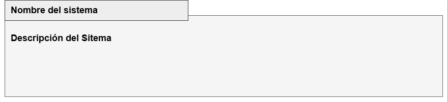
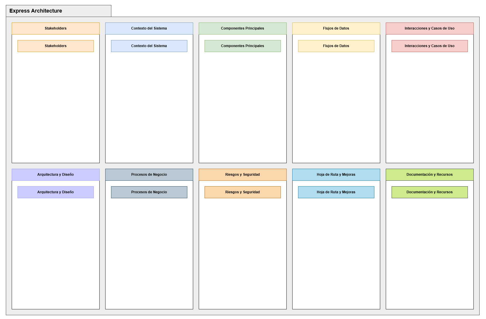
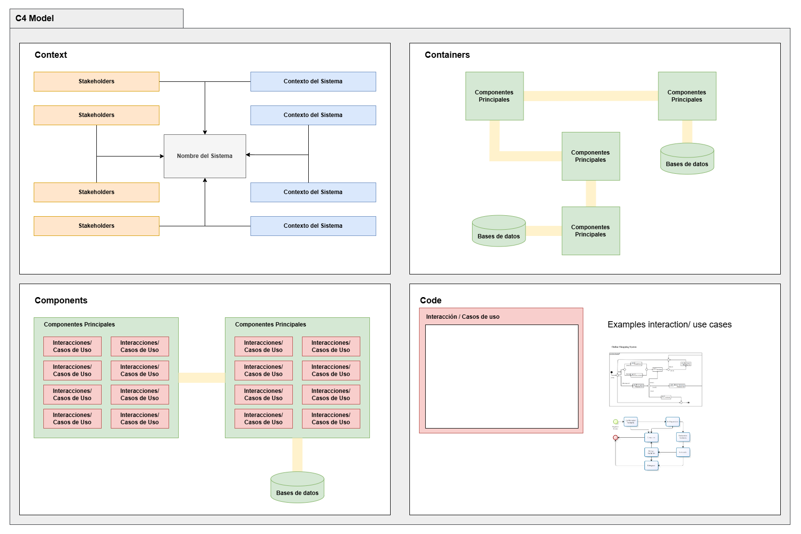
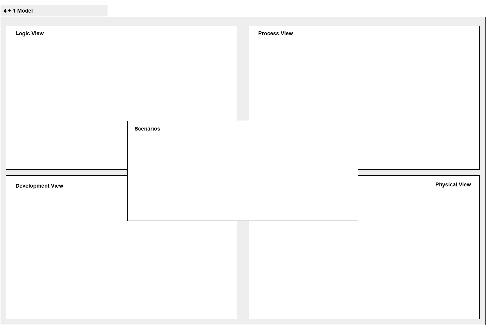

El Architectural Canvas es una herramienta central en la metodología Express Architecture. Su objetivo principal es facilitar la recopilación de información relevante para el diseño y la planificación de sistemas y procesos. Este canvas se inspira en principios del agilismo, promoviendo la colaboración, iteración y flexibilidad en su uso. Además, sirve como base para derivar modelos arquitectónicos más detallados, como el modelo C4 y el modelo 4 + 1, siendo el modelo C4 el principal sugerido para la documentación y representación técnica.

El modelo busca plasmar con claridad tanto la perspectiva del negocio como la de tecnología en un mismo plan, promoviendo una visión integrada y alineada entre ambas áreas.

#### Componentes principales:

1. **Stakeholders:**
   - Identificación de los principales interesados del sistema.
   - Descripción de su rol e impacto en el desarrollo.

2. **Contexto del Sistema:**
   - Descripción del sistema dentro de su entorno.
   - Relación con sistemas externos y objetivos principales.

3. **Componentes Principales:**
   - División del sistema en componentes clave.
   - Listado de tecnologías y servicios principales utilizados.

4. **Flujos de Datos:**
   - Modelado de la comunicación entre componentes.
   - Descripción de los datos que entran y salen del sistema.

5. **Interacciones y Casos de Uso:**
   - Definición de las interacciones entre los usuarios y el sistema.
   - Casos de uso relevantes.

6. **Arquitectura y Diseño:**
   - Principios y patrones de diseño aplicados.
   - Representación del modelo arquitectónico.

7. **Procesos de Negocio:**
   - Documentación de los procesos clave.
   - Ejemplos y diagramas de procesos de negocio.

8. **Riesgos y Seguridad:**
   - Identificación de riesgos técnicos y del negocio.
   - Estrategias para mitigarlos y garantizar la seguridad.

9. **Hoja de Ruta y Mejoras:**
   - Plan de acción para implementar mejoras en el sistema.
   - Priorización de tareas y recursos.

10. **Documentación y Recursos:**
   - Referencias, manuales y guías necesarias para el desarrollo y mantenimiento del sistema.

#### Vistas complementarias:

##### Business Process

Los **Business Process** se centran en capturar y representar los procesos clave del negocio que el sistema debe soportar. Estas tarjetas del Canvas están diseñadas para detallar cómo las operaciones de negocio interactúan con el sistema, identificando los puntos clave de entrada, salida y transformación de datos.

Los procesos de negocio se documentan utilizando la notación **BPMN (Business Process Model and Notation)**, que permite representar visualmente los flujos de trabajo de manera clara y estandarizada. Esto facilita la comprensión entre los equipos técnicos y no técnicos, asegurando que la solución tecnológica esté alineada con los objetivos organizacionales y las necesidades del negocio.

**Componentes Clave:**
- **Actores de negocio:** Quiénes participan en los procesos.
- **Entradas y salidas:** Información clave que fluye hacia y desde los procesos.
- **Puntos de decisión:** Donde se toman decisiones importantes que afectan el flujo.
- **Dependencias:** Interacciones con sistemas externos o componentes internos.

El uso de BPMN permite identificar flujos críticos, puntos de optimización y posibles riesgos, guiando el diseño arquitectónico y la priorización de funcionalidades.

##### Interacciones y Casos de Uso (Technological Process)

Las **Interacciones y Casos de Uso** (o **Technological Process**) están diseñadas para capturar cómo los usuarios y sistemas interactúan con la solución tecnológica. Estas tarjetas del Canvas documentan el flujo lógico de las funcionalidades del sistema desde una perspectiva técnica, proporcionando un puente entre los requisitos del negocio y el diseño arquitectónico.

Las interacciones y casos de uso se representan utilizando **diagramas de vista general de interacciones (Interaction Overview Diagrams)** de **UML**. Esta notación combina diagramas de actividad y secuencia, proporcionando una visión general de los flujos entre actores, componentes y servicios.

**Componentes Clave:**
- **Actores tecnológicos:** Quiénes o qué interactúan con el sistema (usuarios, APIs, servicios externos).
- **Flujo de interacción:** Los pasos detallados que se siguen durante la ejecución del caso de uso.
- **Requisitos funcionales:** Qué debe hacer el sistema para cumplir el caso de uso.
- **Excepciones:** Escenarios donde ocurren errores o situaciones atípicas.

El uso de Interaction Overview Diagrams asegura que las interacciones entre los componentes tecnológicos sean claras y rastreables, proporcionando una base sólida para mapear cómo el sistema responde a las necesidades del negocio y para derivar los modelos arquitectónicos como C4 o 4 + 1.

#### Modelo C4

El modelo C4 complementa el Architectural Canvas al permitir derivar una representación estructurada de sistemas de software a partir de la información recopilada en las tarjetas. Los colores de las tarjetas del Canvas reflejan cómo cada una aporta datos clave para construir los diferentes niveles de abstracción del modelo C4: Contexto, Contenedores, Componentes y Código. Este modelo es particularmente útil para documentar arquitecturas técnicas de forma clara y comprensible, facilitando la comunicación entre equipos técnicos y no técnicos.

#### Modelo 4 + 1

El modelo 4 + 1 utiliza la información organizada en las tarjetas del Architectural Canvas para estructurar las cinco perspectivas principales: Lógica, Proceso, Desarrollo, Física y Escenarios. Los colores de las tarjetas reflejan las conexiones entre las categorías del Canvas y las vistas del modelo, proporcionando un flujo lógico para construir una visión integral del sistema. Este modelo es ideal cuando se requiere un enfoque que conecte tanto los aspectos técnicos como los casos de uso reales, adaptándose a diferentes necesidades de los actores del proyecto.

